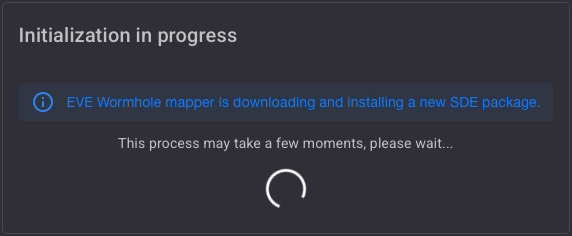
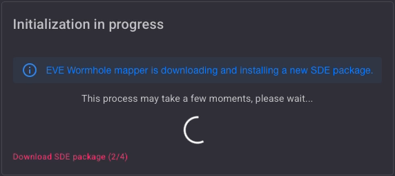
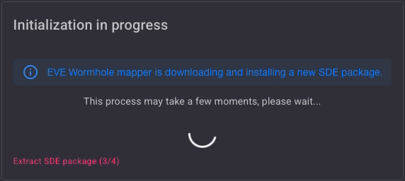
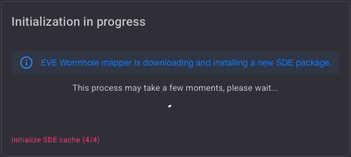
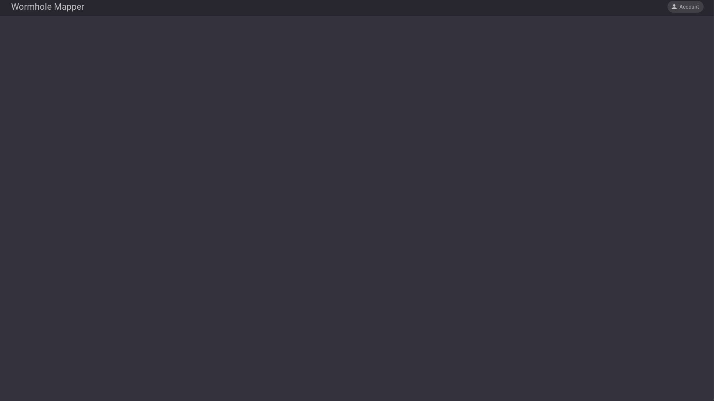

Setting up EVE Wormhole Mapper for the first time involves a few essential steps to create the database and initialize the necessary components.

## Initialization

:::info
On first launch, EVE Wormhole Mapper automatically initializes the database. This process is fully automated — no action is required.
:::

The following steps are performed during initialization:

- **Remove Current SDE Package (1/4):** The existing Static Data Export (SDE) package is removed to ensure no outdated data interferes with the new setup.
- **Download SDE Package (2/4):** The latest SDE package is downloaded. This package contains critical game data required for accurate wormhole mapping.

- **Extract SDE Package (3/4):** The downloaded package is extracted, preparing the data for use.

- **Initialize SDE Cache (4/4):** The system initializes the SDE cache, optimizing performance and ensuring all data is readily accessible.

Once these steps are completed, the main page is displayed and the application is ready for use.

## Sign In

For the first login, you need to authenticate your account. Refer to the **[Authentication Module](../Module/authenticate.md)** for detailed instructions.

---

**Next step →** [Authentication](../Module/authenticate.md)