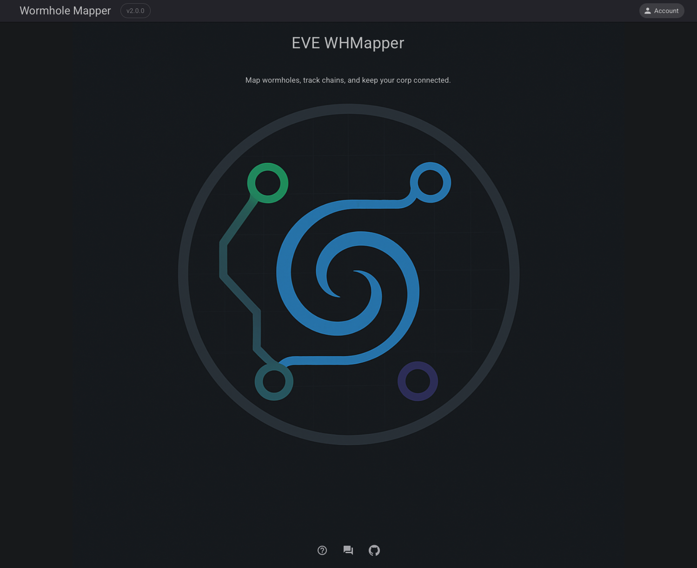

## First Start

Setting up the Eve Wormhole Mapper for the first time involves a few essential steps to create a database and initialize the necessary components to ensure smooth operation.

### Initialization

When you first launch the Eve Wormhole Mapper, the application will automatically initiate a process to set up the database and prepare the system for use. This is crucial for storing and retrieving mapping data effectively. The following steps outline this process:

- **Remove Current SDE Package (1/4):** The existing Static Data Export (SDE) package is removed to ensure no outdated data interferes with the new setup.
- **Download SDE Package (2/4):** The latest SDE package is downloaded. This package contains critical game data required for accurate wormhole mapping.
- **Extract SDE Package (3/4):** The downloaded package is extracted, preparing the data for use.
- **Initialize SDE Cache (4/4):** Finally, the system initializes the SDE cache, optimizing the mapper's performance and ensuring all data is readily accessible.

Once these steps are completed, the main page of the Eve Wormhole Mapper is displayed, indicating that the application is ready for use.

## Sign In

For the first login, you will need to authenticate your account. For detailed steps and instructions, please refer to the **[Authentication Module](../Module/authenticate.md)** documentation. This module guides you through the process of securely signing into the mapper using your EVE Online credentials.

Enjoy your EVE Wormhole Mapper experience! With this powerful tool, navigating the vast expanses of EVE Online's wormholes is more intuitive and efficient.