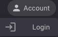
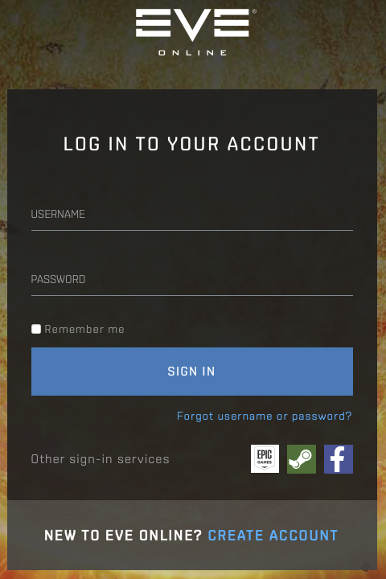
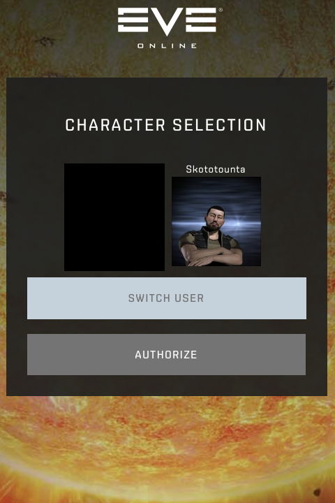
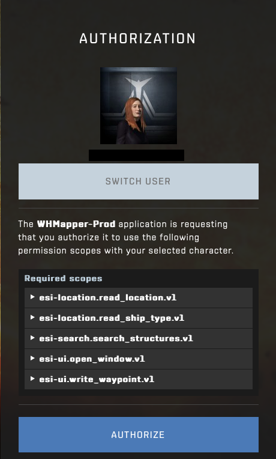
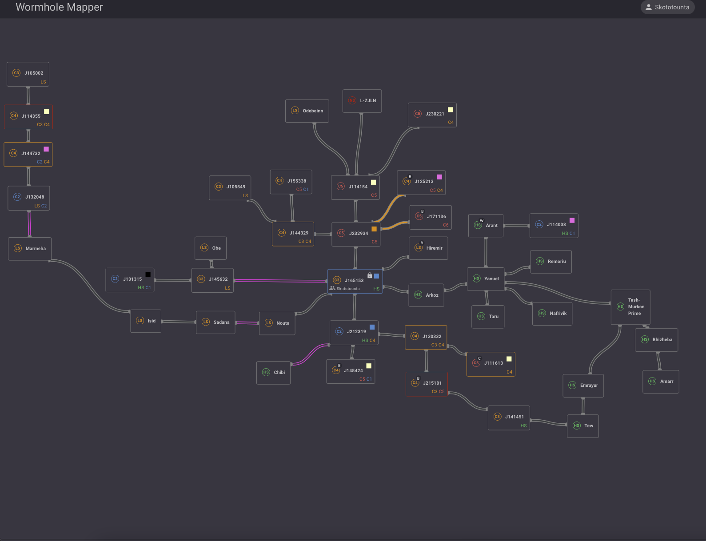
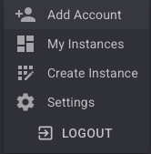

EVE Wormhole Mapper authenticates using your EVE Online account via CCP's Single Sign-On (SSO). Your password is never stored — only a secure CCP-issued token is used.

## Login Flow

1. **Open Account Settings** — click the **ACCOUNT** button on the main interface.

   

2. **Initiate Login** — click **Login** to be redirected to the CCP SSO page.

   

3. **Enter CCP Credentials** — input your CCP username and password.

   

4. **Select a Character** — choose which character to use.

   

5. **Authorize Scopes** — review and approve the required access rights.

   

## After Login

Once CCP authentication succeeds, WHMapper checks your instance membership:

- **You belong to an instance** — the first accessible map loads automatically.

  

- **You don't belong to any instance** — the *No Instance Access* screen is shown. You can create your own instance or ask an administrator to grant you access.

  Refer to the **[Instance](./admin.md)** page for the full walkthrough.

## Multiple Characters

You can link several EVE characters to the same session using the **Add Account** button.

All characters appear in the same tab interface. The active character — used for all mapper actions — is highlighted with a white circle.

