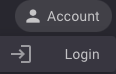
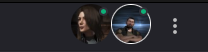

# Authentication
Authenticating with the [Eve Wormhole Mapper](https://github.com/pfh59/eve-whmapper) allows users to utilize their EVE Online account credentials for a seamless login process. This section provides detailed instructions on how to authenticate and manage characters within the mapper.

allows users to utilize their EVE Online account credentials for a seamless login process. This section provides detailed instructions on how to authenticate and manage characters within the mapper.

## Logging into EVE Wormhole Mapper

1. **Access the Account Settings**

   Begin by selecting the **ACCOUNT** button on the main interface. This initiates the authentication flow.

   

2. **Initiate Login**

   Click on the **Login** button. This redirects you to the EVE Online's standard account login page, ensuring a secure connection through CCP's Single Sign-On (SSO).

   

3. **Enter CCP Credentials**

   Input your in-game CCP credentials. This step does not store your password within the application; instead, it uses CCP's secure token-based system to authenticate.

   

4. **Select Your Character**

   Choose your desired character from the list provided. Verify the CCP access rights to ensure the proper permissions are granted for usage.

   

5. **Authorize the Application**

   Review and approve the required scopes necessary for the application's functionality. This step enables the proper access to read the mapper data associated with your character.

   

## Entering EVE Wormhole Mapper

### Authorized Access

Upon successful login, if your character is authorized, the first accessible map for this character displays automatically. You are now ready to start utilizing the wormhole mapping features and visualize your environment.

  

### Unauthorized Access

In cases where the login is successful but the character lacks permissions, a notification message will appear indicating unauthorized access. You may need to contact the administrator to request access.

  

## Adding Multiple Characters

Enhance your mapping capabilities by adding multiple EVE characters under the same map — even if their access is unauthorized. Use the **Add Account** button to link each character individually.

   

All characters appear in the same tab interface:

   

   The currently selected character — the one used for actions in WHMapper — is highlighted with a white circle.

 