## Overview

An **instance** is your isolated WHMapper environment. It groups maps, administrators, and access rules under a single owner (a character, corporation, or alliance). Every user who wants to use WHMapper must belong to at least one instance — either by creating their own or by being granted access to an existing one.

---

## No Access

When you log in for the first time and your character, corporation, or alliance has not yet been granted access to any instance, WHMapper shows the following screen:

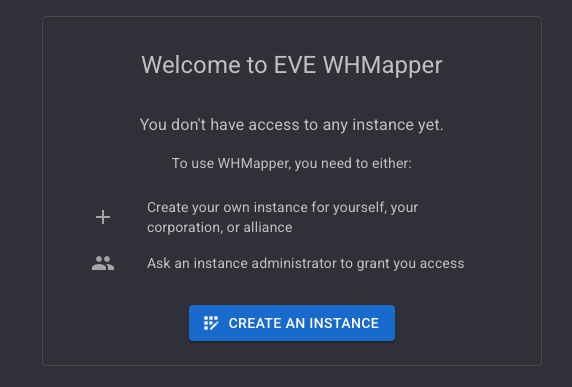

From here you can either:

- **Create an instance** — become the administrator of your own environment.
- **Ask an instance administrator** to grant you access.

---

## Creating an Instance

Click **CREATE AN INSTANCE** to open the registration dialog.

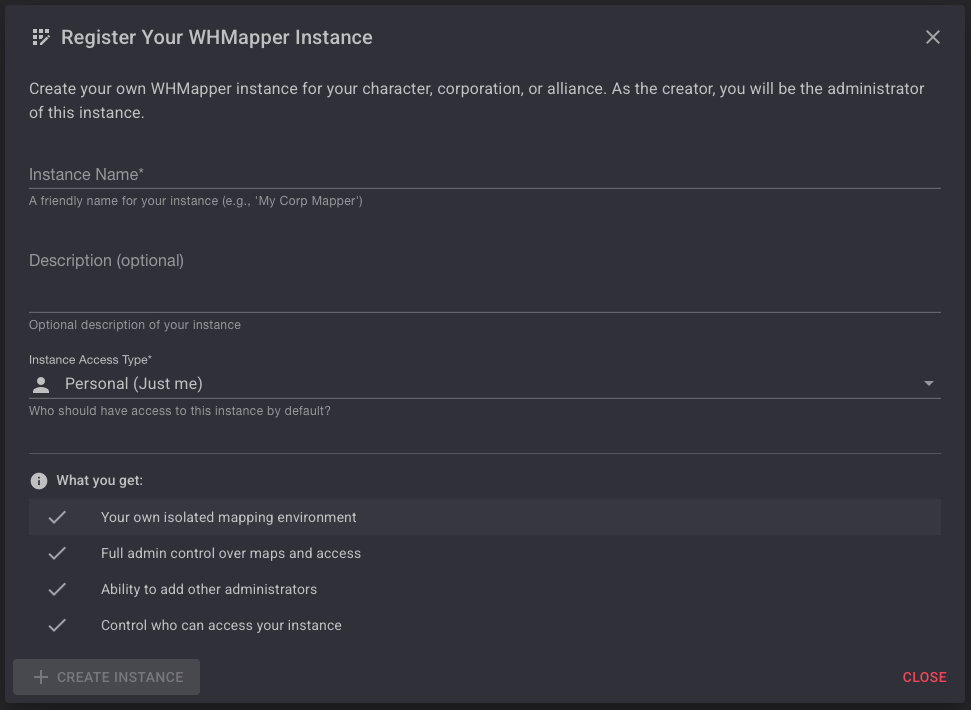

Fill in the fields:

| Field | Required | Description |
|---|---|---|
| **Instance Name** | Yes | A friendly name (e.g. *My Corp Mapper*). |
| **Description** | No | An optional description of the instance. |
| **Instance Access Type** | Yes | Defines who owns the instance — see below. |

### Instance Access Type

The access type determines the owner entity of the instance. The dropdown lists all entities linked to your authenticated character:

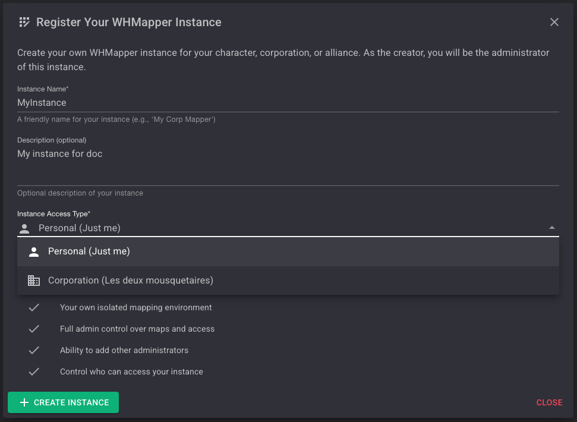

| Option | Meaning |
|---|---|
| **Personal (Just me)** | The instance is owned by your character. |
| **Corporation** | The instance is owned by your corporation. |
| **Alliance** | The instance is owned by your alliance. |

Once the form is valid, click **CREATE INSTANCE**. You become the administrator of the new instance.

:::info What you get as creator
- Your own isolated mapping environment
- Full admin control over maps and access
- Ability to create and manage multiple maps
- Per-map access control to restrict who can see each map
- Ability to add other administrators
- Control over who can access your instance
:::

---

## After Creation — No Map Available

Immediately after creating an instance, WHMapper has no map to display yet. You will see:

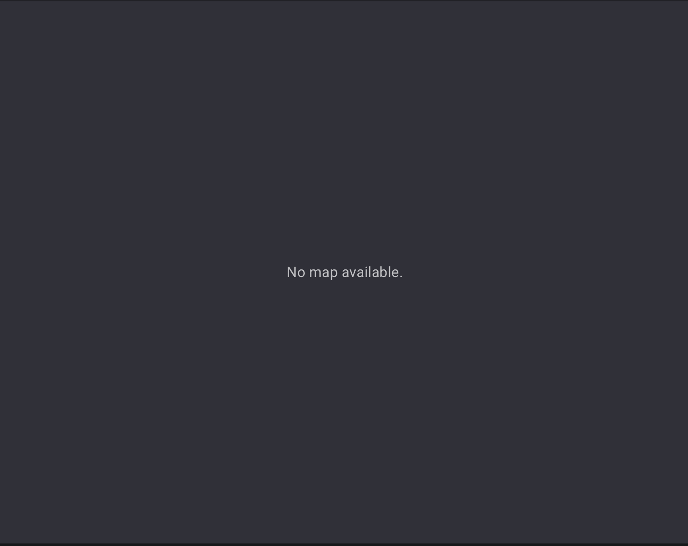

This is expected — you need to add at least one map to your instance before the mapper becomes usable. See [Adding a Map](#adding-a-map) below.

---

## My Instances

Access your instances at any time via the user menu:

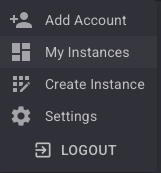

Click **My Instances** to open the instances panel, which lists every instance you are associated with:

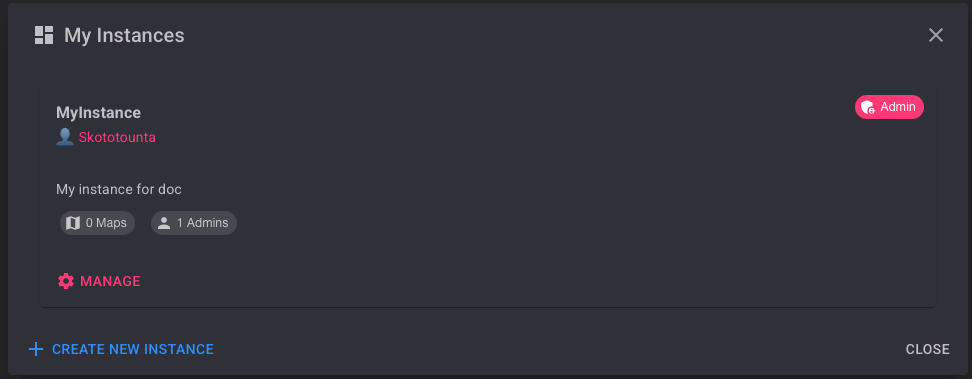

Each entry shows:
- The instance name and owner character
- The description
- The number of maps and administrators
- A **MANAGE** link (visible only to administrators)

To create another instance from this panel, click **+ CREATE NEW INSTANCE**.

---

## Instance Administration

Click **MANAGE** on any instance you administer to open the **Instance Administration** panel:

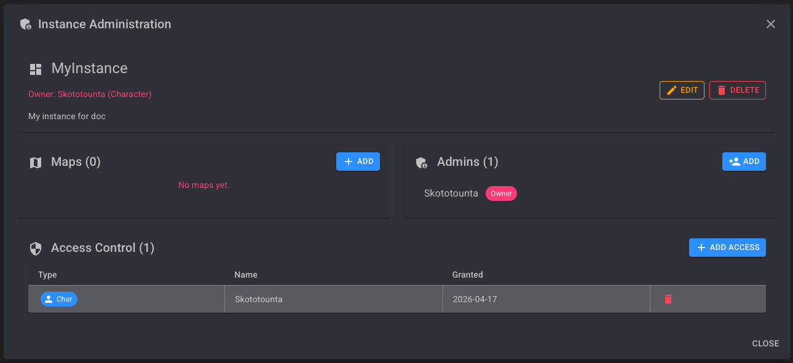

The panel has three sections:

| Section | Description |
|---|---|
| **Maps** | Maps belonging to this instance. |
| **Admins** | Users with administrator rights on this instance. |
| **Access Control** | Characters, corporations, or alliances granted access. |

At the top you can **EDIT** the instance name/description or **DELETE** the instance entirely.

:::warning
Only administrators of an instance can see the **MANAGE** option and access this panel.
:::

---

## Managing Instance Access

The **Access Control** section defines who can access the instance. By default, only the creator's character is listed.

To grant access to a new entity, click **+ ADD ACCESS**:

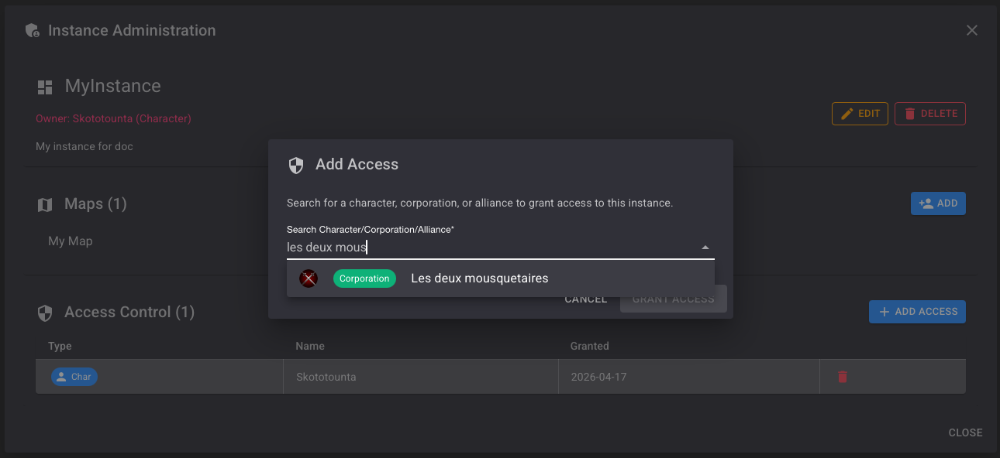

Search by character name, corporation name, or alliance name. Select the result and click **GRANT ACCESS**.

A confirmation toast appears:

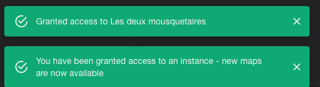

:::tip
When access is granted to a corporation or alliance, all members of that entity gain access to the instance. Individual character entries can be used for finer-grained control.
:::

To revoke access, click the delete icon on the corresponding row.

---

## Adding Administrators

In the **Admins** section, click **+ ADD** to promote another character to administrator. Administrators can manage maps, access control, and instance settings.

The creator of the instance always appears as **Owner** and cannot be removed from the admin list.

---

## Editing an Instance

Click **EDIT** in the Instance Administration panel to modify the instance name or description:

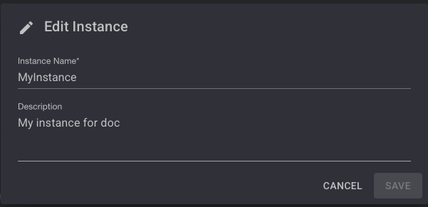

Click **SAVE** to apply the changes or **CANCEL** to discard them.

---

## Adding a Map

In the **Maps** section, click **+ ADD**. The *Add Map* dialog appears:

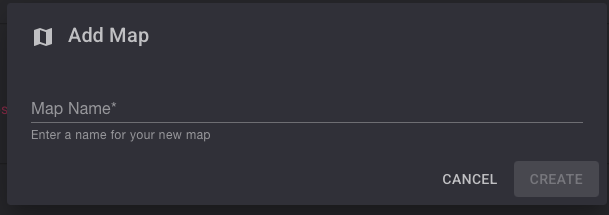

Type a name for the map. The **CREATE** button becomes active once a name is entered:

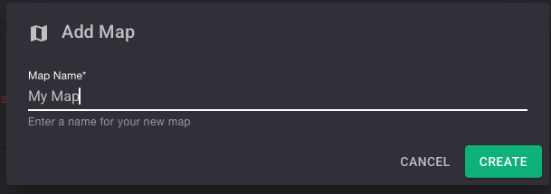

Click **CREATE**. The map is added to the instance:

You can repeat this process to add as many maps as needed. To add a second map, click **+ ADD** again, enter the new name, and click **CREATE**:

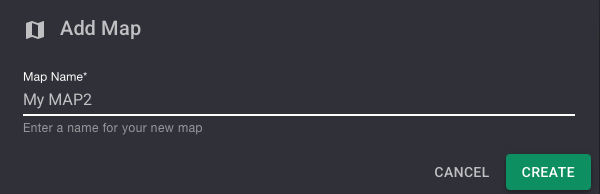

---

## Multi-Map Management

An instance can contain multiple maps. All users with access to the instance can view all maps by default.

Each map appears as its own tab in the mapper interface, allowing users to switch between maps without leaving the application:

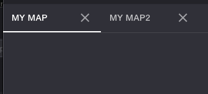

The **Maps** section of the Instance Administration panel displays the total number of maps and lists each one with its action buttons:

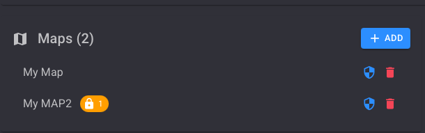

A padlock badge on a map entry indicates that access restrictions have been applied to that map (the number shows how many access entries are configured).

:::warning Tracker only works on the active map
The **tracking system** (automatic chain update, signature sync) operates exclusively on the **active map** — the tab currently selected in the mapper. Switching to a different tab changes which map receives live updates. Make sure all scouts and mappers are on the same active map.
:::

---

## Map Access Control

Each map can have its own access restrictions, independent of the instance-level access control. By default, every user with access to the instance can view every map.

### Map Action Buttons

In the **Maps** section of the Instance Administration panel, each map row shows two icons on the right:

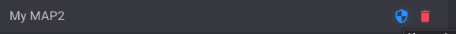

- **Blue shield icon** — opens the Map Access Control dialog for that map.
- **Red trash icon** — deletes the map.

Hovering over each icon shows its tooltip:

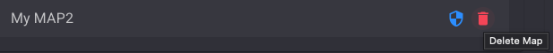

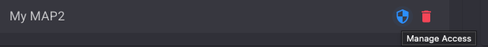

### Default State — No Restrictions

When no access entries have been added, the dialog shows a blue **No restrictions** banner:

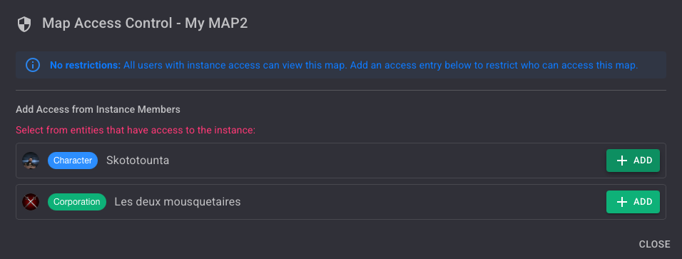

> **No restrictions:** All users with instance access can view this map. Add an access entry below to restrict who can access this map.

The lower section lists all entities that currently have instance-level access. Click **+ ADD** next to any entry to restrict the map to that entity.

### Restricted State

Once at least one access entry is added, the dialog switches to a yellow **Restricted access** banner:

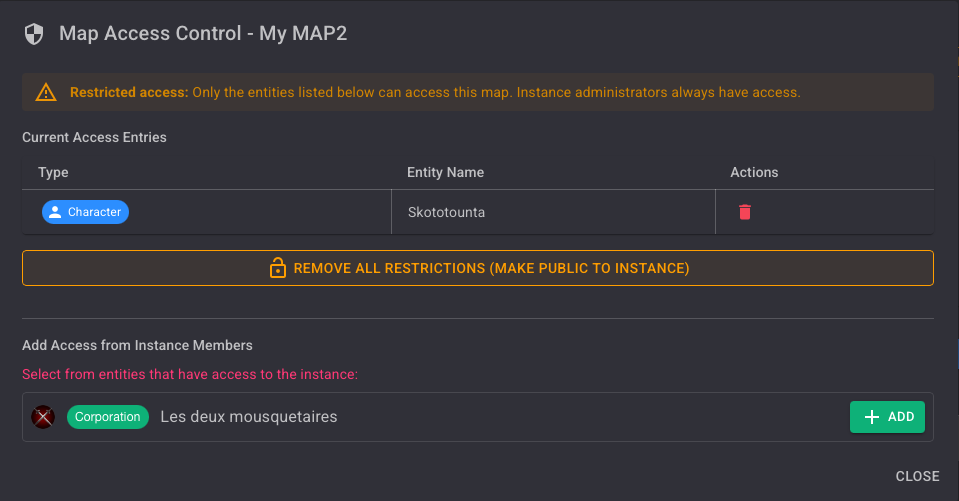

> **Restricted access:** Only the entities listed below can access this map. Instance administrators always have access.

| Column | Description |
|---|---|
| **Type** | Whether the entry is a Character, Corporation, or Alliance. |
| **Entity Name** | The name of the entity granted access. |
| **Actions** | Red trash icon to remove the entry. |

To remove all restrictions at once and make the map public to the instance again, click the **REMOVE ALL RESTRICTIONS (MAKE PUBLIC TO INSTANCE)** button.

:::info Instance admins always have access
Regardless of per-map restrictions, **instance administrators** always retain access to all maps in their instance.
:::

---

## Multi-Instance Access

A user can belong to multiple instances simultaneously — either as a direct member, through their corporation, or through their alliance. In that case, WHMapper aggregates all maps from all accessible instances and displays them as tabs in a single view.

The maps visible to you depend on two levels of rules:
1. **Instance-level access** — you must be granted access to the instance.
2. **Per-map access** — if a map has restrictions configured, only the listed entities can open it, even if they have instance access.

Instance administrators always retain full access to all maps in their own instance, regardless of per-map restrictions.

---

**Next step →** [Using the Map](./map.md)
