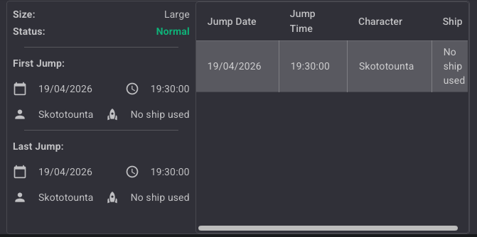
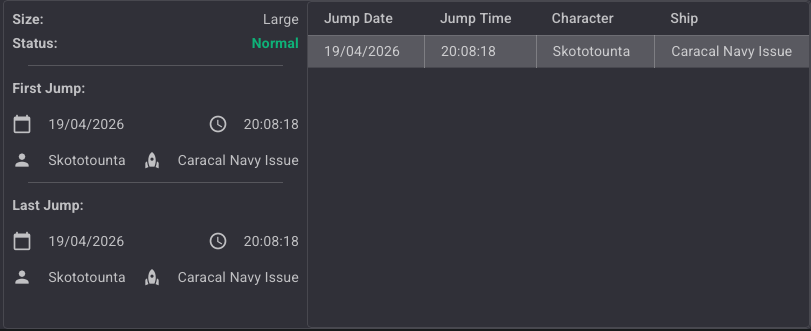
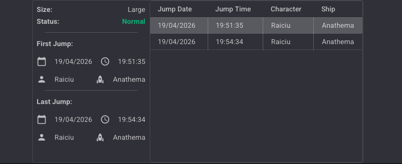
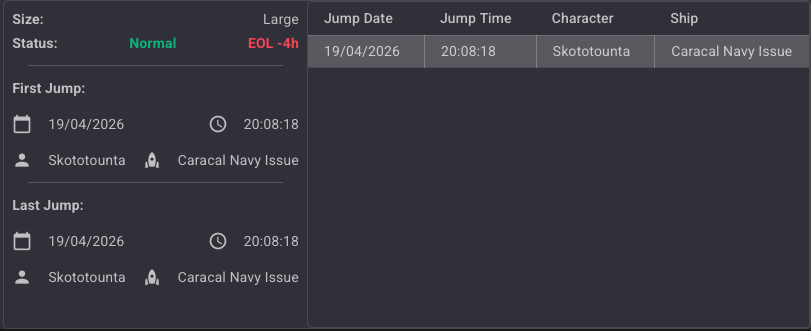
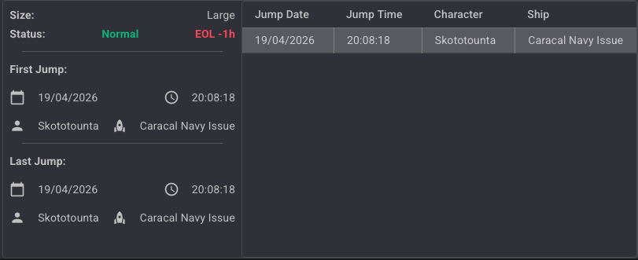
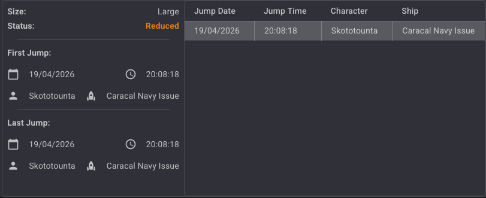
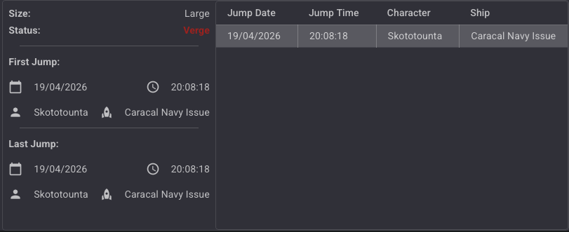

## Introduction

The **Jump** module tracks all transits through wormhole connections. Every time a character jumps through a connection, a log entry is recorded with a timestamp and the ship used. The module also displays summary information about the connection's status and its first and last recorded jump.

### Key Features

- **Jump Log**: Each jump is recorded with its date, time, character name, and ship used.
- **Wormhole Status Tracking**: Displays the current status of the wormhole (Normal, EOL, Reduced, Verge).
- **First & Last Jump Summary**: Quick overview of when the connection was first used and when it was last used.
- **No Ship Detection**: When a connection is created manually (without actually jumping), no ship is recorded.

---

## Jump Panel

The Jump panel is split into two areas:

- **Left side**: Summary information about the connection (size, status, first and last jump).
- **Right side**: Full jump log table showing every recorded transit.

### Summary Panel

| Field | Description |
|---|---|
| **Size** | Mass category of the wormhole (e.g. Large, Medium, Small, Frigate) |
| **Status** | Current wormhole status (see [Wormhole Status](#wormhole-status)) |
| **First Jump** | Date, time, character, and ship of the first recorded jump |
| **Last Jump** | Date, time, character, and ship of the most recent jump |

### Jump Log Table

| Column | Description |
|---|---|
| **Jump Date** | Date of the jump (EVE time) |
| **Jump Time** | Time of the jump (EVE time) |
| **Character** | Name of the character who jumped |
| **Ship** | Ship used for the jump, or *No ship used* if the connection was created manually |

---

## No Ship Used

When a connection between two systems is created **manually** (by drawing a link on the map rather than physically jumping through), no ship information is recorded. In this case, the ship field displays **"No ship used"**.

This is the expected behavior: since no actual transit occurred, the tracker cannot capture a ship.

---

## Jump Logging with Ship

When a character **physically jumps** through a wormhole, the module records the event automatically. The ship used at the time of the jump is captured and displayed in both the summary panel and the jump log.

Multiple jumps through the same connection are all listed in the log table. The **First Jump** and **Last Jump** fields in the summary panel update accordingly.

---

## Wormhole Status

The **Status** field reflects the current state of the wormhole and updates in real time.

| Status | Color | Description |
|---|---|---|
| **Normal** | Green | The wormhole is healthy with no notable changes. |
| **EOL -4h** | Red | The wormhole is at End of Life — estimated less than 4 hours remaining. |
| **EOL -1h** | Red | The wormhole is at End of Life — estimated less than 1 hour remaining. |
| **Reduced** | Orange | The wormhole mass has been reduced (a large ship or multiple ships have passed through). |
| **Verge** | Red | The wormhole is on the verge of collapse — critical mass remaining. |

### Normal

### EOL -4h

### EOL -1h

### Reduced

### Verge

