## Introduction

The map in EVE WHMapper is a vital navigational tool for EVE Online players, offering comprehensive insights into the intricate web of wormhole space. It is designed to enhance your abilities for strategic planning and spontaneous exploration.

### Key Features

- **Inter-System Connections:**
  - The map provides a detailed overview of connections between systems, aiding in efficient route planning and identifying new strategic opportunities.

- **Universal Accessibility:**
  - Available to all users, the map ensures accessibility while implementing robust access controls via the Admin Module to manage permissions effectively.

- **Focused Content:**
  - To maintain clarity and relevance, the map includes only systems and wormhole connections, whether through stargates or natural wormholes.

- **Live Synchronization Between Clients:**
  - A crucial feature, live synchronization ensures that all users accessing the map see consistent, up-to-date information in real-time.
  - **Enhanced Coordination:**
    - Enables immediate sharing of map changes and updates, fostering efficient teamwork and strategic implementation.
  - **Unified Gameplay Experience:**
    - Ensures that all players see the same map alterations, minimizing potential for miscommunication or errors and promoting a seamless gaming experience.

Live synchronization and other map features will significantly boost your efficiency in navigating wormhole space, thereby enriching your overall EVE Online experience. This tool is designed to not only support strategic planning but also cater to impromptu exploration endeavors.

## Pilot Tracking

Pilot tracking provides a dynamic solution for real-time location monitoring of team members, significantly boosting coordination and safety within your operations. This feature seamlessly integrates with the map, delivering the following benefits:

- **Automatic Updates**: The map position is refreshed automatically, removing the need for manual input and ensuring you have the most current locations at all times.
- **Auto-detection of Connections**: System connections between pilots are auto-detected, allowing you to concentrate on exploration without distraction.
- **Enhanced Coordination**: By knowing the real-time locations of your team members, you can better coordinate movements and strategies, optimizing mission outcomes.

This system's ability to maintain real-time awareness supports efficient navigation and discovery in EVE Online's vast and complex wormhole space.

### Automatic Tagging of Target Systems

The automatic tagging feature assigns sequential letters (A, B, C, etc.) to target systems of the same class originating from the same system. This functionality simplifies navigation and bookmark management within the game.

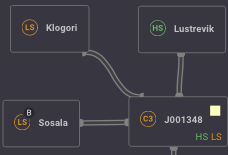

### Manual Adjustment

Tags can be manually adjusted by using the following keys:
- `+` : Increment tag
- `-` : Decrement tag
- `Up` : Move tag up
- `Down` : Move tag down

### Bookmarks exemple in game

Here are examples of how the tags appear, aiding easy navigation:
- **">> LS - EJC"**: Represents a low-security system tag.
- **">> LSB - KWE"**: An example of subsequent tagging from the same origin.
- **">> HS - MCE"**: Represents a high-security system tag.

By automating and customizing system tagging, you enhance your operational efficiency and map readability within the game environment.

## Selection Methods in the Map Interface

The map interface provides intuitive methods for selecting systems and connections, enhancing user interaction and navigation. When you select an element, it is highlighted, indicating activation and enabling specific features.

### Selecting System

Selecting systems within the map interface allows you to engage with various modules that enhance system management and navigation.

- Systems can be selected individually with a left-click.
- The selected system will be highlighted.
  
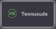

- **Modules Activated:**
  - Selecting a system activates the following modules:
    - **[System Info Module](../Module/system_infos.md)**
    - **[Signature Module](../Module/signature.md)**
    - **[Route Planner Module](../Module/route_planner.md)**

  - These modules provide detailed information and tools for efficient navigation.
  
  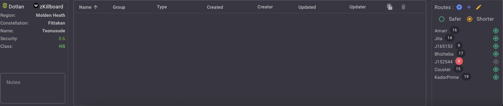

### Selecting a Connection

Selecting connections between systems is crucial for managing navigation routes and system interactions.

- Connections can also be selected individually with a left-click.
- The selected connection will appear highlighted.
   

- **Features Activated:**
  - Selecting a connection activates the **[Jump Module](../Module/jump.md)**.
  - This module facilitates management and execution of jumps between systems, streamlining your workflow.
  
  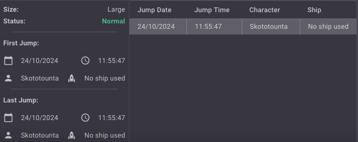

### Selecting Multiple Systems

The map interface supports selecting multiple systems simultaneously, facilitating efficient bulk operations and navigation.

- **Multiple System Selection:**
  - You can select multiple systems by holding down the `Shift` key and using a left-click.
  - As you drag, a highlighted selection area will appear, enabling you to envelop and select several systems at once.
  
  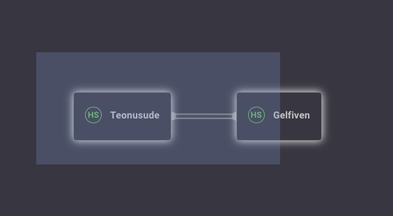

  - Once selected, the systems within the highlighted area will be individually highlighted to indicate inclusion in the selection.

  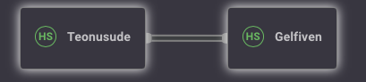

## Moving Systems

The map interface allows for flexible organization, letting you move systems individually or in groups to suit your preferences and workflow needs.

- **Individual System Movement:**
  - Click and drag a system to move it to a new position on the map.
  - The system will follow your cursor's path, and its new position will be set upon release of the mouse button.

- **Multiple System Movement:**
  - Use the multi-select feature by holding down the `Shift` key and left-clicking to create a selection area around multiple systems.
  - Once selected, click and drag any one of the highlighted systems to move the entire group.

## Adding Systems

To manually add systems to your map, follow these steps:

1. **Access the Map Menu**:
   - Right-click on the map and select the appropriate option to add a system manually.

   

2. **Initiate System Search**:
   - The search for a system begins as soon as the first three letters or numbers are typed.

   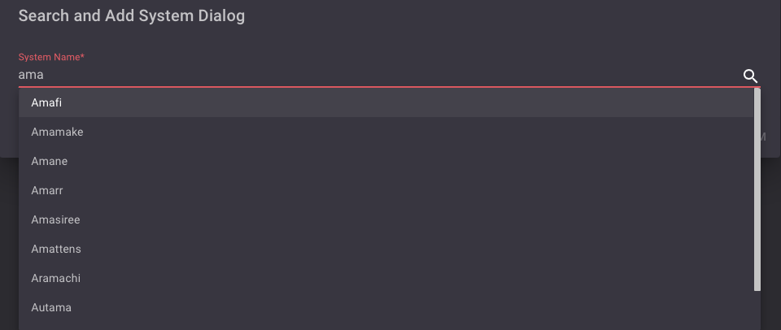

3. **Select and Add Your System**:
   - Choose the desired system from the list (e.g., Amamake).

   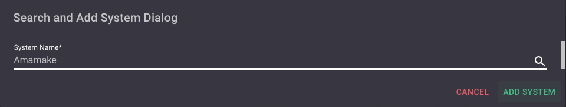

4. **Confirmation of Addition**:
   - A success notification will appear upon successful addition of the system.

   

By following these steps, you can effectively add new systems to your map, ensuring your navigation setup remains current and comprehensive.

## Editing System and Connection

### Editing System
To manage and update the system, you can edit it using the context menu options. Follow these steps to access and use these options effectively.

1. **Access the System**
- **Right-click** on the system you wish to edit. A context menu will appear showing various options you can use.

  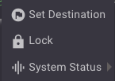

2. **Available Options**

- **Set to Destination**
  - Open the context menu and `Set To Destination` menu item:
  
  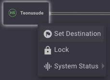

  - This option sets the current system as a destination within the game. It's useful for navigation and planning.

  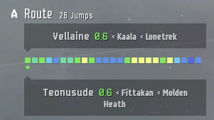

- **Lock the System**
  - Open the context menu and select the `Lock System`menu item:

  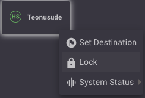
  
  - The system will be locked and appear as such on your map.

  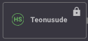

  - **Note:** Locking a system is useful to prevent accidental deletion or movement.

- **UnLock the System**
  - Open the context menu and select the `Unlock System`menu item:

  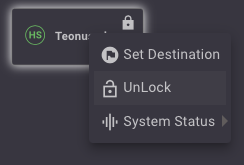
  
  - The system will be unlock and return to the normal state.

  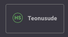

#### Define System Status
- Open the context menu and navigate to the `Status` menu item:

  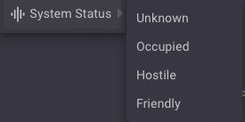

- **Select the desired status from the following options:**
  - **Unknown:** No information about this system.
  
    
  - **Occupied:** The wormhole is occupied by potential enemies.

    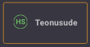
  - **Hostile:** The wormhole contains enemies.

    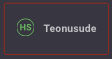
  - **Friendly:** The wormhole contains allies.

    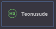

### Editing Connection

To manage and update the links between systems effectively, you can edit system connections using the context menu options.

  1. **Access the Connection:**
     - Right-click on the system connection you wish to edit. A context menu will appear.
     
     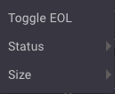

  2. **Available Options:**
  
     - **Define Connection as EOL (End of Life):**
       - Open the link menu item and toggle the system to `End Of Life`.

      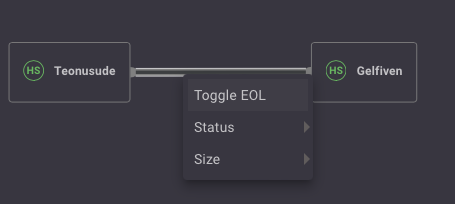

       - This option allows you to mark the connection as nearing its expiration, indicating that the wormhole is approaching the end of its stable phase.
              
       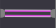
  
     - **Define Connection Status:**
       - Open the link menu item for "Status" :
       
         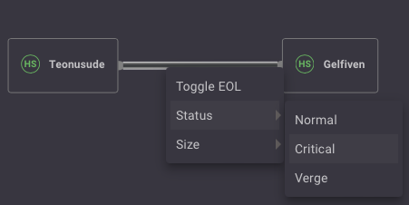
       
       - Select the desired status:
         - **Normal:** Regular mass status.
           - 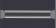
         - **Critical:** The wormhole's mass is reaching a critical threshold.
           - 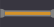
         - **Verge:** The wormhole is on the verge of collapse.
           - 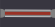
       

     - **Define the Size of WH:**
       - Open the link menu item for `Size` :
         
         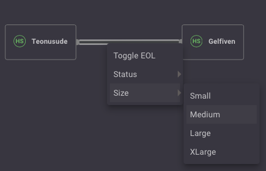

       - Select the appropriate size:
         - **Small**
           - 
         - **Medium**
           - 
         - **Large**
           - 
         - **Extra Large**
           - 
       
By utilizing these options, players can keep track of the status and characteristics of wormhole connections, facilitating better strategic planning and minimizing the risk of encountering unexpected changes in wormhole stability.

## Deleting Systems

1. **Select Systems:**
   - Navigate to the map or list view where your systems are displayed.
   - Click to highlight the systems you wish to delete. You can select multiple systems by holding down the `Ctrl` key while clicking on each system.

2. **Delete Selected Systems:**
   - Once you have selected the systems, simply press the `Del` (Delete) key on your keyboard.

3. **Note:**
   - **No Confirmation Message:** There will be no confirmation prompt before deletion. Ensure that you have selected the correct systems to avoid accidental deletion.
   - **Locked System Warning:** If you attempt to delete a locked system, a warning notification will be displayed.
   
   
