## Overview

The **Route Planner** panel helps you calculate optimal travel paths between systems—either through jump gates or mapped wormholes. It includes:

- A **route type selector** (Custom, Thera, Turnur).
- A **path preference selector** (Safer / Shorter).
- Action buttons for managing your route list.
- A dynamic list of destination systems with jump counts.
- Automatic pathfinding based on wormhole and gate connections.

If a system is selected and has a valid route (gate or mapped wormhole), the planner automatically calculates the best path based on your preferences.  
By default, the planner uses the **Custom** route type and the **Shorter** path preference.

---

## Route Type

The route type determines which connections are factored into the pathfinding algorithm.

| Type | Description |
|---|---|
| **Custom** | WHMapper's own algorithm using K-space stargates and mapped wormhole connections. |
| **Thera** | Extends the Custom algorithm by incorporating **Thera**'s daily public K-space wormhole connections, potentially offering shorter routes through known space. |
| **Turnur** | Extends the Custom algorithm by incorporating **Turnur** triglavian connections. |

**Example — Thera, Shorter mode (from J165153):**  
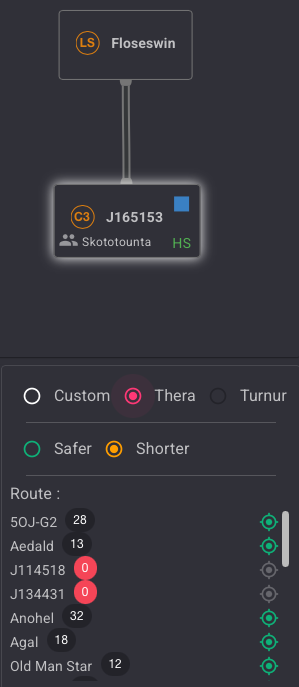

**Example — Thera, Safer mode (from J165153):**  
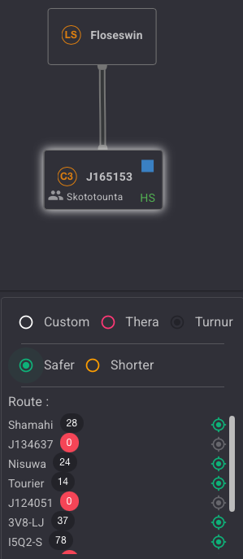

:::info
Thera and Turnur connections are sourced dynamically. Jump counts may vary as those connections change throughout the day.
:::

---

## Action Buttons

The action buttons vary depending on your user role.

### Admin View

As an **administrator**, you can define a global list of key systems (e.g., Jita, Amarr). These will be visible to **all characters** with access to the map.

### User View

As a **primary character**, you can still create your own custom system list, in addition to those defined by admins.

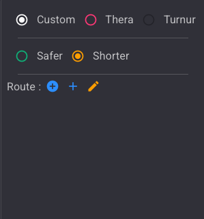

:::info Multi-character attribution
If you have linked several EVE characters to your session (see [Authenticate → Multiple Characters](./authenticate.md#multiple-characters)), any route entry you add — regardless of which character is currently active — is recorded under your **primary character**. The same rule applies to signature imports and notes.
:::

---

## Add a System

To add a system to your route list:

1. **Click the Add button**:
   - Admin: 
   - User: 

2. **The system search dialog appears**:  
   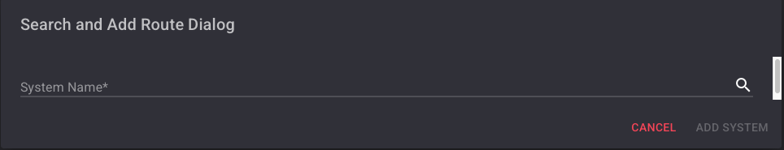

3. **Start typing** the name of the system (e.g., `Jita`):  
   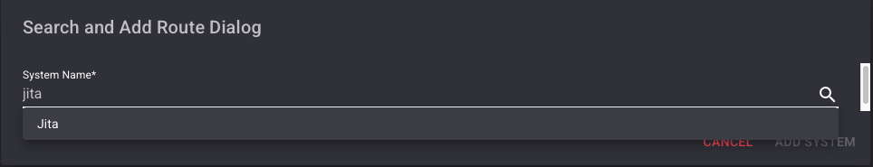

   :::tip
   Enter at least 3 characters — the list will update in real time.
   :::

4. **Click Add System** to confirm. Systems are added to your list with a jump count of **0** until a map system is selected.

   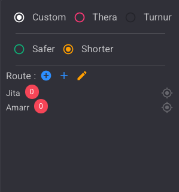

   Click **Cancel** to close without adding.

---

## Edit a System

To modify your route list:

- Click the **Edit button**: 

Once enabled, a **delete icon** will appear next to each entry.

:::caution Admin Permissions
- **Admins** can remove both global and personal systems.
- **Primary characters** can only delete systems they personally added (i.e. systems recorded under their primary character).
:::

**Admin View**  
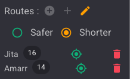

**User View**  
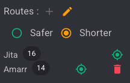

---

## Delete a System

To remove a system from your list:

1. Click the **delete icon** beside the system: 

2. Confirm the action in the dialog:  
   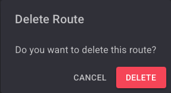

---

## Automatic Path Calculation

### How It Works

1. **Select a system** on the map.
2. The planner calculates jump distances between the selected system and each listed destination, according to the **Route Type** and **path preference** (Shorter / Safer).

---

### When a Route Exists

If a route is found, the number of jumps appears next to each destination, accompanied by a green indicator icon.

Routes can be:
- Fully mapped wormhole connections.
- Standard stargate paths.
- Thera or Turnur connections (when the corresponding route type is selected).

**Examples:**

- Via wormhole (from J165153):  
  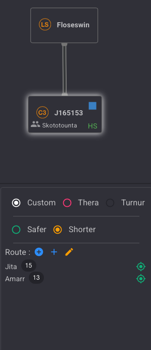

- Via K-space gates (from Floseswin):  
  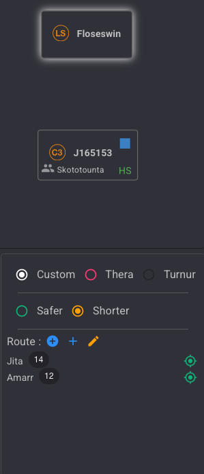

---

### When No Route Exists

If no path is found, the jump count will show **`0`** with a red indicator icon.

This can happen if:
- The selected system is a wormhole with no mapped connections to reach the destination.
- A listed system is isolated from the current network.

**Example:**  
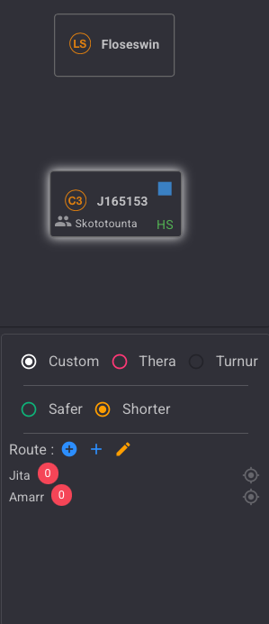

---

## Display a Route Path on the Map

You can visually display the route path (highlighted in yellow) between the selected system and any destination in your list.

:::info Note
Only **mapped systems** are shown in the path on the map.  
Unmapped K-space hops are not visualized even if the route technically passes through them.
:::

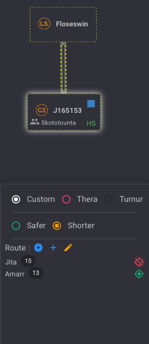

### Toggle Path Display

- To **show** a path:  
  Click this icon beside the system: 

- To **hide** the path:  
  Click the same icon again: 

---

### Route Path Tooltip

When hovering over the destination system icon, a **tooltip displays the complete route path** — listing every system you need to travel through to reach your destination.

Each system in the tooltip is represented by a **color-coded dot** matching the security status.

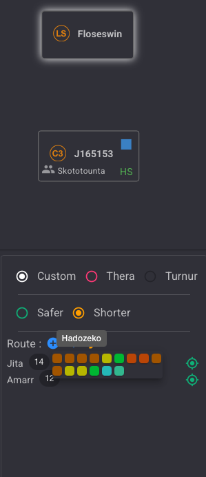