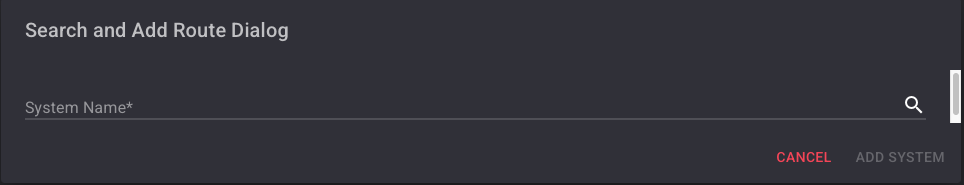

# Route Planner

## Overview

The **Route Planner** panel helps you calculate optimal travel paths between systems—either through jump gates or mapped wormholes. It includes:

- Action buttons for managing your route list.
- A dynamic list of destination systems.
- Automatic pathfinding based on wormhole and gate connections.

If a system is selected and has a valid route (gate or mapped wormhole), the planner automatically calculates the best path based on your preference: **Shorter** or **Safer**.  
By default, the planner uses the **Shorter** route configuration.

:::info
WHMapper uses a custom-built algorithm to compute the most efficient route between systems.
:::

---

## Action Buttons

The action buttons vary depending on your user role:

### Admin View

As an **administrator**, you can define a global list of key systems (e.g., Jita, Amarr). These will be visible to **all characters** with access to the map.

### User View

As a **regular user**, you can still create your own custom system list, in addition to those defined by admins.

---

## Add a System

To add a system to your route list:

1. **Click the Add button**:
   - Admin: 
   - User: 

2. **The system search dialog appears**:  
   

3. **Start typing** the name of the system (e.g., `Jita`):  
   

   :::tip
   Enter at least 3 characters — the list will update in real time.
   :::

4. **Choose your action**:
   - Click **Add System** to confirm.
     - Admin Example:  
       
     - User Example:  
       
   - Click **Cancel** to close the dialog.

---

## Edit a System

To modify your route list:

- Click the **Edit button**: 

Once enabled, a **delete icon** will appear next to each entry.

:::caution Admin Permissions
- **Admins** can remove both global and personal systems.
- **Regular users** can only delete systems they personally added.
:::

**Admin View**  

**User View**  

---

## Delete a System

To remove a system from your list:

1. Click the **delete icon** beside the system: 

2. Confirm the action in the dialog:  
   

---

## Automatic Path Calculation

### How It Works

1. **Select a system** on the map.
2. The planner calculates jump distances between the selected system and each listed destination, based on the selected mode:
   - **Shorter** (default)
   - **Safer**

---

### When a Route Exists

If a route is found, the number of jumps appears next to each destination.

Routes can be:
- Fully mapped wormhole connections.
- Standard stargate paths.

**Examples:**

- Via wormhole:  
  

- Via K-space gates:  
  

---

### When No Route Exists

If no path is found, the jump count will show **`0`**.

This can happen if:
- The selected system is a wormhole with no mapped connections.
- A listed system is isolated from the current network.

**Example:**  

---

## Display a Route Path on the Map

You can visually display the route path (in yellow) between the selected system and any destination in your list.

:::info Note
Only **mapped systems** are shown in the path.  
Unmapped systems are not visualized even if the route technically exists.
:::

### Toggle Path Display

- To **show** a path:  
  Click this icon beside the system: 

- To **hide** the path:  
  Click the same icon again: 