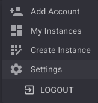
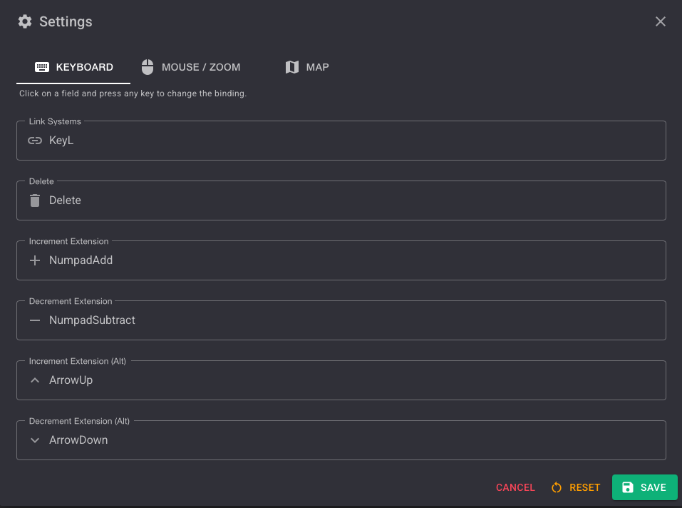
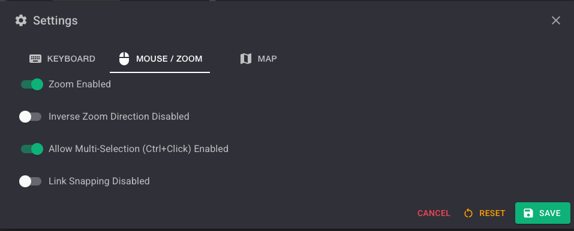
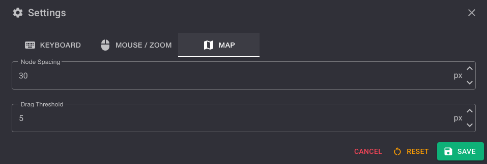

## Introduction

The **Settings** module lets you customize the default behavior of EVE WHMapper for your session. You can configure keyboard shortcuts, mouse and zoom options, and map layout parameters.

Once saved, these settings are **automatically applied every time your primary character connects** — you never need to reconfigure them between sessions.

---

## How to Open Settings

Click the **Settings** entry in the left sidebar menu.

The Settings dialog opens with three tabs: **KEYBOARD**, **MOUSE / ZOOM**, and **MAP**.

---

## Keyboard Tab

The **KEYBOARD** tab lets you rebind the default keyboard shortcuts used on the map.

> Click on any field and press any key to change its binding.

### Default Bindings

| Action | Default Key | Description |
|---|---|---|
| **Link Systems** | `L` | Manually create a connection between two selected systems |
| **Delete** | `Delete` | Delete the selected system or connection |
| **Increment Extension** | `NumpadAdd` | Increase the tag extension counter |
| **Decrement Extension** | `NumpadSubtract` | Decrease the tag extension counter |
| **Increment Extension (Alt)** | `ArrowUp` | Alternative key to increase the tag extension counter |
| **Decrement Extension (Alt)** | `ArrowDown` | Alternative key to decrease the tag extension counter |

---

## Mouse / Zoom Tab

The **MOUSE / ZOOM** tab controls mouse interaction and zoom behavior on the map.

### Options

| Option | Default | Description |
|---|---|---|
| **Zoom Enabled** | ON | Enables mouse-wheel zoom on the map canvas |
| **Inverse Zoom Direction** | OFF | Reverses the zoom scroll direction |
| **Allow Multi-Selection (Ctrl+Click)** | ON | Allows selecting multiple nodes by holding `Ctrl` and clicking |
| **Link Snapping** | OFF | Snaps connections to the nearest node when dragging |

---

## Map Tab

The **MAP** tab controls layout and interaction thresholds for the map canvas.

### Options

| Option | Default | Unit | Description |
|---|---|---|---|
| **Node Spacing** | `30` | px | Minimum spacing between system nodes on auto-layout |
| **Drag Threshold** | `5` | px | Minimum drag distance before a node move is registered |

---

## Saving and Resetting

| Action | Effect |
|---|---|
| **SAVE** | Persists your settings. They are automatically applied every time your primary character connects. |
| **RESET** | Restores all settings to their factory defaults. |
| **CANCEL** | Closes the dialog without saving any changes. |

:::tip
Use **RESET** at any time to return to the default configuration without having to adjust each option manually.
:::
