# Signature

## Introduction

The "Signature" section of the EVE Wormhole Mapper documentation provides detailed information on managing and using signatures in the game. Signatures are essential elements for navigating and exploring wormhole space. A signature in EVE Online represents a point of interest in space that players can explore. These signatures can include data sites, relic sites, combat sites, and wormholes. EVE Wormhole Mapper has a dedicated module to manage Signatures in each system.

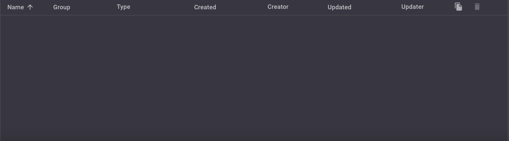

### Key Features

- **Share System Signature Information**: Easily share signature data with other players.
- **Add/Update/Delete Multiple Signatures at Once**: Efficiently manage multiple signatures in a single operation.
- **Check for New Signatures Within a Second**: Quickly detect new signatures in the system.
- **Updated Signature Type Information**: Keep signature type information up-to-date.
- **Live Synchronization Between Clients**: Ensure all clients have the latest signature data in real-time.

## How to Import Signatures

### Simple Usage

1. Open the signature panel in the game. By default, all signatures in the system are not probed.
   
   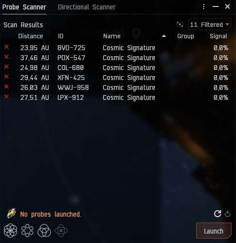

2. Use the EVE Wormhole Mapper module to import signatures:
   - Ensure the selected node is correct in EVE Wormhole Mapper.
   - Click on the import button: 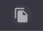
   - Copy and paste the in-game signatures into the import dialogue.
   - The system validates the signature format using a regular expression for all supported EVE languages, preventing invalid formats.
   
   Examples:
   
     - **No scanned signatures:**
     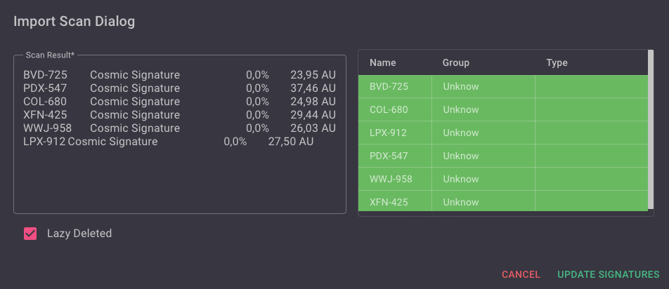
   
     - **Partially scanned signatures:**
     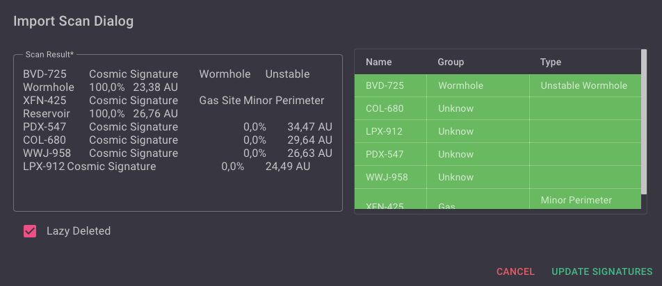
   
   - View the partial import in the signature module:
   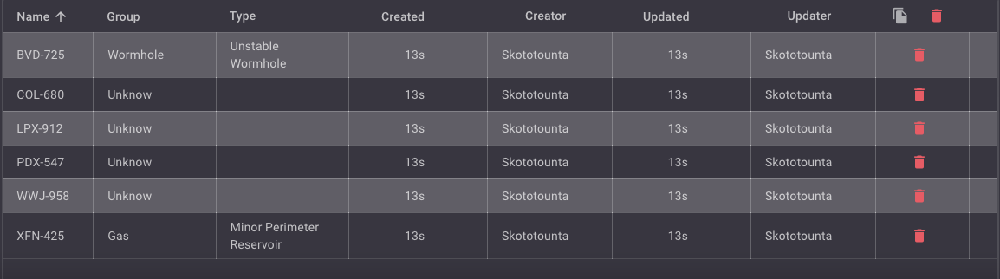

3. The first user to import a signature will be noted with a timer from when the signature was created. This user is the first updater, and all information will be the same. Subsequent users importing the same signature will be noted as updates, and the updated timer will reset at the moment of the update.

:::info
    Signatures in EVE Online appear and disappear frequently and have an expiration delay. It is very useful to know the expiration delay of wormholes to prevent autocollapse.
:::

### Avanced Usage With Lazy Delete

- **Unchecked (default)**: Imported signatures will be compared with saved signatures:
  - New signatures appear in **green**.
  - Updated signatures appear in **grey**.

- **Checked**: Imported signatures will be compared with saved signatures, and all saved signatures not present in the imported signatures will be deleted.
  - New signatures appear in **green**.
  - Updated signatures appear in **grey**.
  - Deleted signatures appear in **red**.

:::tip
Use this feature to determine updates needed for bookmarks in the game.
:::

Example with signatures already imported:

- **Lazy Delete Unchecked:**
  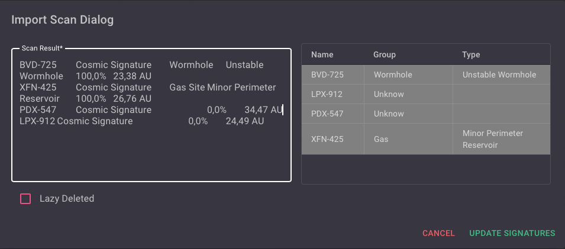
- **Lazy Delete Checked:**
  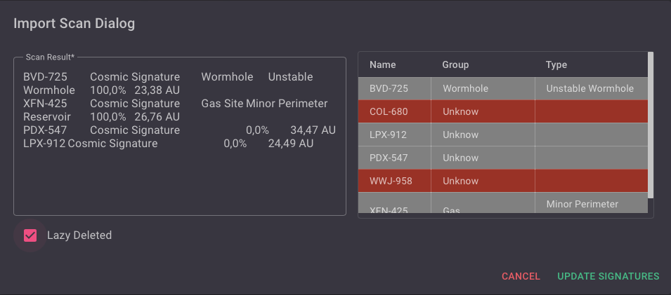

:::warning
Avoid using the lazy delete option with a partial selection of signatures to prevent accidental deletions.
:::

## Update Signature Manually

Probing signatures provides more detailed information. You can update signatures via the import system or manually.

:::tip
It is useful to update wormhole type information.
:::

To update manually:

1. Click on the table row to make it editable.

2. Change the group from the list.
    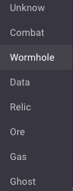

3. Change the type of the signature:
   - If it is not a wormhole, the type of signature is a free text field.
     
     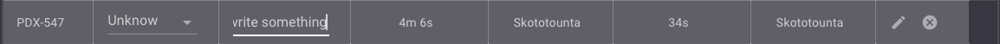
   
   - If the signature is a wormhole, the type of signature is a list of wormholes including names and destination system types (HS/LS/NS/Type of wormhole...).
     
     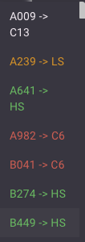
    
4. Click on the action button to commit or discard your changes : 
    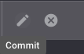

Example of wormhole signature updating:
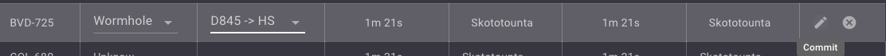

## Delete a Signature

If a signature is expired in the game, you can delete it manually:

1. Click on the delete button at the end of the row: .

   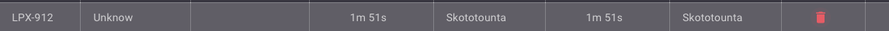

2. A confirmation box is displayed.
   
   

Select the signature to delete after confirmation; otherwise, the action is canceled.

## Delete All Signatures

You can clear all imported signatures:

1. Click on the delete icon button  near 

2. A confirmation box appears to approve or not the deletion.
   
   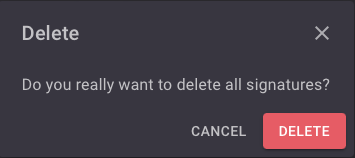

All signatures will be deleted after confirmation; otherwise, the action is canceled.