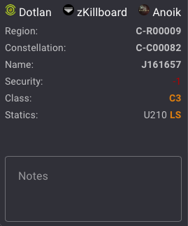

# System Info

## Introduction

The "System Info" module of the EVE Wormhole Mapper displays information about the selected system and provides some shortcuts. The information includes the system's name, constellation, region, security status, and class (HS/LS/NS/...). For wormholes, it provides extra information with static systems and wormhole effects.

## Key features

System information is composed of three sections:

- **Shortcuts to Third-Party External Websites**: Includes shortcuts to Dotlan, zKillboard, and Anoik for wormhole information.
- **Information Section**: Provides details about the selected system on the map, including Region, Constellation, System Name, Security Status, and Class System. For wormholes, it includes effects and statics.
- **Notes Section**: Allows each player to add extra information about a system.

## Thirdparty Shortcuts

This section has two or three shortcuts to dedicated websites related to the selected system.

- **Dotlan**: Provides detailed maps and information about regions, constellations, and systems in EVE Online.
- **zKillboard**: Offers killboard statistics and information about recent kills and losses in the selected system.
- **Anoik**: Specifically for wormholes, it provides information about wormhole effects, statics, and other related data.

These three third-party websites offer more information to players to analyze the situation or plan a route.

## System Information

This section displays selected system information: Region, Constellation, Name of the system, Security status, and Class system.

Security status has color coding: 
- Red for systems with SS < 0 : 
- Orange between 0.1 and 0.4: 
- Green if > 0.5 : 

Class security is the type of the system. For k-space systems:
- HS: 
- LS: 
- NS: 

Wormholes:
- C1: 
- C2: 
- C3: 
- C4: 
- C5: 
- C6: 
- C13: 
- C14 (sentinel): 
- C15 (barbican): 
- C16 (vidette): 
- C17 (redoubt): 
- C18 (conflux): 
- Thera: 
- Pochven: 

Extra properties is available onfly for wormhole system : Effect and Statitics

Some Wormhole have effect. Effects type are :
- black hole : 
- Cataclysmic : 
- Magnetar : 
- Pulsar : 
- Red Giant :
- Wolf Rayet : 

Moving your mouse over the effect icon display the effects variations and their impact for all ships and modules in this system.

Statics is the list of wormhole Class and Type.

Moving your mouse over the wormhole type display info about the wormhole connection behavior/

## Notes

