# System Information

## Overview

This documentation provides details on how to utilize the system information panel effectively. The panel is equipped with shortcuts to third-party websites for additional data, displays crucial details about the selected system, and offers vital properties and effects, especially for wormhole systems.

### Third-Party Shortcuts

- **[Dotlan](https://evemaps.dotlan.net/)**: Offers detailed maps and data concerning regions, constellations, and systems in EVE Online.
- **[zKillboard](https://zkillboard.com/)**: Provides killboard statistics, recent kills, and losses within the selected system.
- **[Anoik.is](http://anoik.is/)**: Specializes in wormhole information, including effects and statics.

These resources are invaluable for players needing to analyze situations or plan routes efficiently.

## System Details

This section showcases vital information about the selected system: Region, Constellation, System Name, Security Status, and Class System.

### Security Status

Security status has a color-coded system for quick recognition:

- **Red:** Systems with a Security Status (SS) < 0 
  
  
- **Orange:** Systems between 0.1 and 0.4
  
  
- **Green:** Systems with SS > 0.5
  

### Class System

The class security type of the system is categorized into k-space systems and wormholes.

#### K-space Systems

- **High Security (HS):** 
  
  
- **Low Security (LS):** 
  
  
- **Null Security (NS):** 
  

#### Wormholes

- **Classes C1 to C6 and C13 to C18:**
   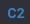 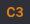  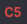 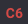 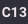 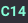 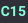 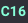  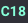

- **Thera:**
  

- **Pochven:**
  

### Extra Properties for Wormhole Systems

Additional attributes available for wormhole systems include Effects and Statics.

#### Effects

Some wormholes exhibit special effects classified into types:

- **Black Hole:**
  
  
- **Cataclysmic:**
  
  
- **Magnetar:**
  
  
- **Pulsar:**
  
  
- **Red Giant:**
  
  
- **Wolf Rayet:**
  

Hovering over the effect icon will reveal variations and impacts on ships and modules in that system.

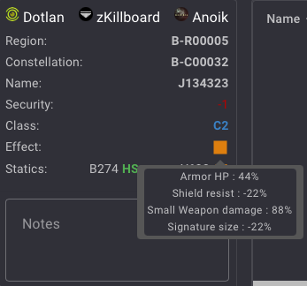

#### Statics

Statics provide a list of wormhole Class and Type.

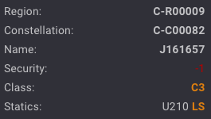
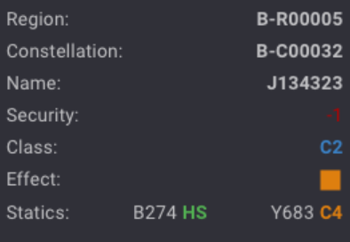

Hover over the wormhole type to see information about the wormhole's connection behavior.

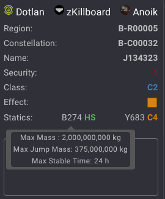

## Notes

### Adding Personal Notes

To enhance your navigation and planning experience, the system information panel allows users to add notes for each system. This feature is particularly useful for keeping track of strategic information, personal observations, or reminders related to specific locations.

### How to Use System Notes

#### Add a Note:

- Click on the text area to begin creating a note.
- Start typing your content (e.g., "nothing inside").
  
  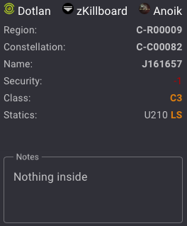

:::info
After a few seconds of inactivity, an autosave function is triggered, which automatically saves your note. A confirmation message will appear to confirm the save.

:::

#### Delete a Note:

- Click on the text area to focus on the existing note.
- Erase the text if you wish to remove the note.

:::caution
If you delete the selected system from your view, the note is not deleted. When the system appears again, the note will automatically be linked to it.
:::

